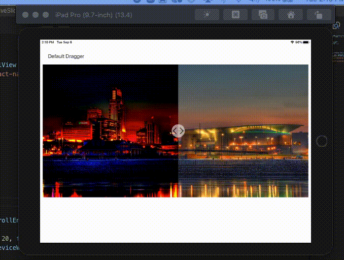

# Before-After comparison slider for react-native with hooks and functional components


This is a comparison slider component to compare two images, components and etc.
This is an improvised version of Malik Aliyev's react-native-before-after-slider.


## Installation
```bash
npm i react-native-before-after-slider-v2
```

## Expo

[Open project in the browser](https://expo.io/@vmaryada/ReactNativeSlider)

## Demo


## API

| Property            | Optional | Default      | Description                                |
| ------------------- | -------- | ------------ | ------------------------------------------ |
| width               | yes      | screen width | width of the slider                        |
| height              | yes      | width/2      | height of the slider                       |
| draggerWidth        | yes      | 50           | width of the dragger component             |
| initial             | yes      | 0            | initial position of the dragger            |
| onMoveStart         | yes      | empty        | function to call on dragger move start     |
| onMove              | yes      | empty        | function to call on dragger move           |
| onMoveEnd           | yes      | empty        | function to call on dragger move end       |

## Usage

```javascript
import React, {useState} from 'react';
import { Text, StyleSheet, View, Dimensions, Image, Platform, ScrollView } from 'react-native';
import Compare, { Before, After, DefaultDragger, Dragger } from 'react-native-before-after-slider-v2';


function Slider() {
    const deviceWidth = Dimensions.get("window").width;
const deviceHeight = Dimensions.get("window").height;
const [state, setState] = useState({scrollEnabled: true})

const onMoveStart =() =>{
    setState({scrollEnabled: false});
}
const onMoveEnd = () => {
    setState({scrollEnabled: true});
}
    return (
        <ScrollView style={{marginTop: 50}} scrollEnabled={state.scrollEnabled} contentContainerStyle={{alignItems:'center'}}>
<StatusBar hidden/>
        <Text style={{marginBottom: 20, color: '#333', paddingLeft: 20, fontSize: 20}}>Default Dragger</Text>
        <Compare initial={deviceWidth/2} draggerWidth={50} width={deviceWidth-20} onMoveStart={onMoveStart} onMoveEnd={onMoveEnd}>
          <Before>
            <Image source={{uri:'https://firebasestorage.googleapis.com/v0/b/milanlaser-fcb24.appspot.com/o/omaha_bw.jpg?alt=media&token=9864378d-74d9-4579-830d-a56e50dc017d'}} style={{width: deviceWidth-20, height: deviceWidth/2}} />
          </Before>
          <After>
            <Image source={{uri:'https://firebasestorage.googleapis.com/v0/b/milanlaser-fcb24.appspot.com/o/omaha_color.jpg?alt=media&token=7b3c5be6-ee90-40ec-9f1c-4b52ce655322'}} style={{width: deviceWidth-20, height: deviceWidth/2}} />
          </After>
          <DefaultDragger />
        </Compare>
        <Text style={{marginVertical: 20, color: '#333', paddingLeft: 20, fontSize: 20}}>Custom Dragger</Text>
        <Compare initial={deviceWidth/2} draggerWidth={50} width={deviceWidth-20} onMoveStart={onMoveStart} onMoveEnd={onMoveEnd}>
          <Before>
            <Image source={{uri:'https://firebasestorage.googleapis.com/v0/b/milanlaser-fcb24.appspot.com/o/omaha_bw.jpg?alt=media&token=9864378d-74d9-4579-830d-a56e50dc017d'}} style={{width: deviceWidth-20, height: deviceWidth/2}} />
          </Before>
          <After>
            <Image source={{uri:'https://firebasestorage.googleapis.com/v0/b/milanlaser-fcb24.appspot.com/o/omaha_color.jpg?alt=media&token=7b3c5be6-ee90-40ec-9f1c-4b52ce655322'}} style={{width: deviceWidth-20, height: deviceWidth/2}} />
          </After>
          <Dragger>
            <View style={{position: 'absolute', top: 0, right: 24, bottom: 0, left: 24, backgroundColor: '#fff', opacity: .6}}></View>
            <View style={{position: 'absolute', top: deviceWidth/4, left: 10, backgroundColor: '#fff', opacity: .9, width: 30, height: 30, marginTop: -15, transform: [{ rotate: '45deg'}]}}></View>
          </Dragger>
        </Compare>
       

      </ScrollView>
    )
}

export default Slider
```
